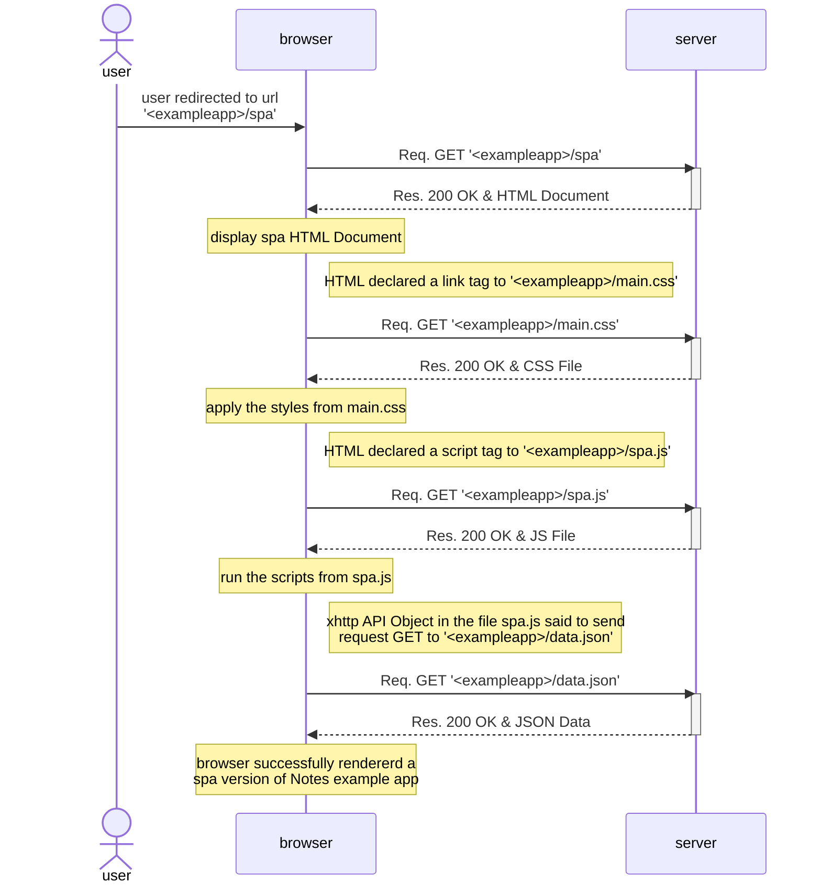

```mermaid
sequenceDiagram
    actor user
    participant browser
    participant server

    user ->> browser: user redirected to url <br> '<exampleapp>/spa'
    browser ->> server: Req. GET '<exampleapp>/spa'
    activate server
    server -->> browser: Res. 200 OK & HTML Document
    deactivate server
    note over browser: display spa HTML Document    
    note right of browser: HTML declared a link tag to '<exampleapp>/main.css'
    browser ->> server: Req. GET '<exampleapp>/main.css'
    activate server
    server -->> browser: Res. 200 OK & CSS File
    deactivate server
    note over browser: apply the styles from main.css
    note right of browser: HTML declared a script tag to '<exampleapp>/spa.js'
    browser ->> server: Req. GET '<exampleapp>/spa.js'
    activate server
    server -->> browser: Res. 200 OK & JS File
    deactivate server
    note over browser: run the scripts from spa.js
    note right of browser: xhttp API Object in the file spa.js said to send <br> request GET to '<exampleapp>/data.json'
    browser ->> server: Req. GET '<exampleapp>/data.json'
    activate server
    server -->> browser: Res. 200 OK & JSON Data
    deactivate server
    note over browser: browser successfully rendererd a <br> spa version of Notes example app
```